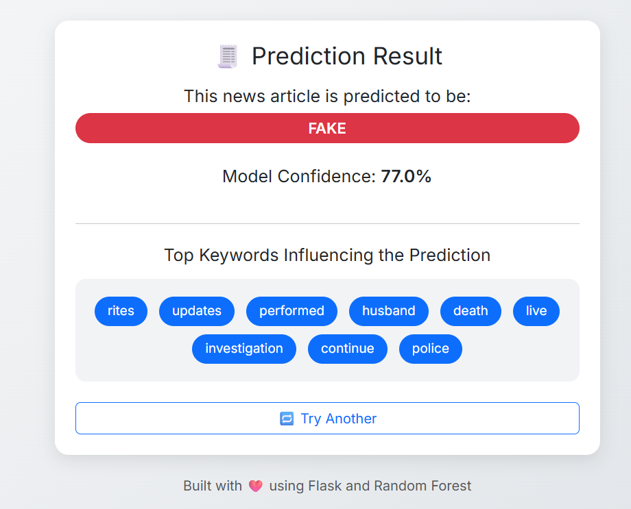

# 📰 Fake News Detector

## 🧠 Objective

This project aims to develop a machine learning-based web application that detects whether a news article is **Fake** or **Real**. It also displays a **confidence score** for the prediction and highlights the **top keywords** that influenced the decision.

---

## 🔍 Project Description

This application leverages **Natural Language Processing (NLP)** and **Machine Learning** to classify news articles. It features a clean, responsive **Flask web interface** built with **Bootstrap 5**.

### 📌 Key Features

* 🌐 **Flask-based web interface**: A user-friendly and interactive online platform.
* 🔍 **Real-time prediction with confidence score**: Get instant results with an indication of how certain the model is.
* 🧠 **Random Forest classifier**: Utilizes a robust machine learning algorithm, achieving approximately **99% accuracy**.
* 🧾 **Highlights important TF-IDF keywords**: Understand which words are most influential in the fake/real news classification.
* ⚙️ **Clean, modular folder structure**: Easy to navigate and maintain the codebase.

---

## 📂 Dataset

The project uses the **Fake and Real News Dataset** from Kaggle.

👉 [**Download Dataset Here**](https://www.kaggle.com/datasets/clmentbisaillon/fake-and-real-news-dataset)

After downloading, create a `data/` folder in your project's root directory and place both `Fake.csv` and `True.csv` inside it:
data/
├── Fake.csv
└── True.csv

> ❗ **Note:** The dataset is not included in this repository to keep it lightweight.

---

## 📷 Web App Screenshots

### 🏠 Home Page


### 📊 Prediction Result Page



---

## 🧰 Tech Stack

---

| Tool           | Purpose               |
| :------------- | :-------------------- |
| Python 3.10    | Programming Language  |
| Flask          | Web Framework         |
| Scikit-learn   | Machine Learning      |
| Pandas / NumPy | Data Processing       |
| Bootstrap 5    | Frontend Styling      |
| Joblib         | Model Saving/Loading  |

---

## 🚀 How to Run the Project

You can easily run this project locally by following these steps:

---

### 1. 📁 Clone the Repository

Open your terminal or command prompt and execute:

' ```bash 
git clone [https://github.com/SoumajyotiDhut/FakeNewsDetector.git](https://github.com/SoumajyotiDhut/FakeNewsDetector.git)
cd FakeNewsDetector 
 ` ``` `
2. ⚙️ Install Requirements
Install all necessary Python packages:

 ' ```bash 
pip install -r requirements.txt
 ` ``` `
3. 📥 Download Dataset from Kaggle
Download the Fake and Real News Dataset from the link provided above: https://www.kaggle.com/datasets/clmentbisaillon/fake-and-real-news-dataset

Create a folder named data/ in your project's root directory and place the downloaded Fake.csv and True.csv files inside it. Your structure should look like this:

data/
├── Fake.csv
└── True.csv
4. 🧠 Train the Model
Run the training script. This will process the dataset and generate the trained machine learning model and TF-IDF vectorizer.

Bash

python train_model.py
This command will create a model/ folder containing:

model/
├── fake_news_model.pkl
└── tfidf_vectorizer.pkl
5. 🚀 Run the Web App
Start the Flask web application:

Bash

python app.py
Open your web browser and navigate to:

[http://127.0.0.1:5000](http://127.0.0.1:5000)
✅ The app is now running locally! You can input any news article to get a prediction with a confidence score and highlighted keywords.

🛑 To Stop the App
Simply press Ctrl + C in your terminal where the server is running.
